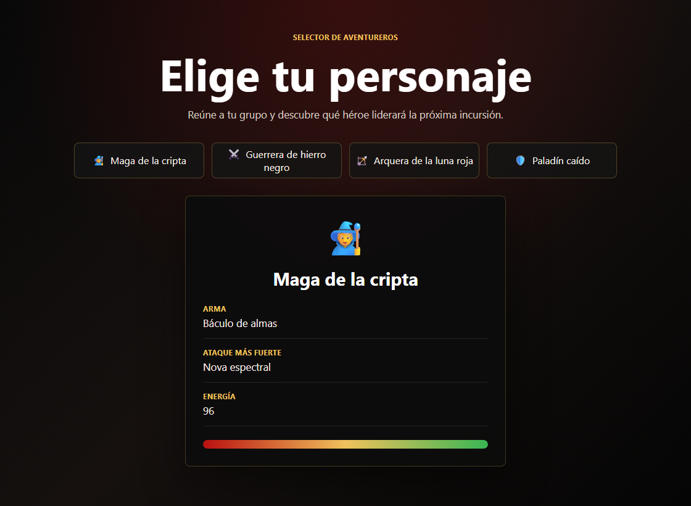

# Selector de personajes en React

Aplicación sencilla construida con React y Vite para practicar `useState`, componentes, props e importación de datos desde archivos externos.

El proyecto permite elegir un personaje de inspiración fantástica y ver su información principal en pantalla. La estética se ha planteado con un tono oscuro, gótico y limpio, manteniendo el alcance del ejercicio original.



## Funcionalidades

- Listado de personajes importado desde un archivo externo.
- Selección de personaje mediante botones.
- Renderizado condicional cuando todavía no hay personaje seleccionado.
- Componente reutilizable `Tarjeta` que recibe la información por props.
- Barra visual de energía según el nivel del personaje.
- Estilos separados en archivos CSS.

## Tecnologías

- React
- Vite
- JavaScript
- JSX
- CSS

## Estructura del proyecto

```text
src/
+-- components/
|   +-- Tarjeta.jsx
+-- data/
|   +-- personajes.js
+-- styles/
|   +-- App.css
|   +-- global.css
+-- App.jsx
+-- main.jsx
```

## Instalación

Instala las dependencias del proyecto:

```bash
npm install
```

## Ejecución en desarrollo

Arranca el servidor local:

```bash
npm run dev
```

Después abre la URL que indique la terminal, normalmente:

```text
http://localhost:5173
```

## Build de producción

Genera la versión optimizada:

```bash
npm run build
```

## Criterios de implementación

- Los datos de personajes viven en `src/data/personajes.js`.
- La lógica de selección se gestiona en `App.jsx` con `useState`.
- El componente `Tarjeta` solo se encarga de mostrar la información recibida.
- Los textos visibles están en castellano.
- El código usa nombres claros y responsabilidades separadas.
- No se han añadido librerías innecesarias.

## Personajes incluidos

- Maga de la cripta
- Guerrera de hierro negro
- Arquera de la luna roja
- Paladín caído

## Estado del proyecto

Ejercicio completado con la funcionalidad principal y el extra de estilos visuales con barra de energía.
